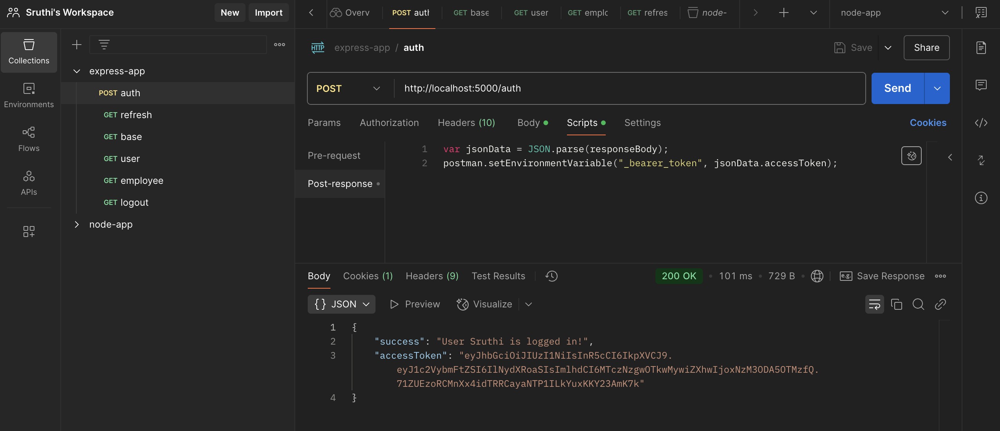

# simple-express-app
A basic express application that serves content over HTTP.

### Features
1. Can serve html and json data over HTTP
2. JWT authentication
3. Event Logging
4. CORS handling

### Setup and Installation
#### Prerequisites
[Node.js](https://nodejs.org/en) installed on your system.

#### Step 1: Clone the repository:
```
git clone https://github.com/SruthiKrish19/simple-express-app.git
```

#### Step 2: Install dependencies:
```
npm install
```

#### Step 3: Run the Application:
To start the server, use the following command:
```
npm start
```
alternatively use Nodemon to start the development server
```
npm run dev
```

#### Step 4: Using the APIs
You can interact with the application through the defined routes, from Postman (or any prefered tool) via http://localhost:5000 (or the port specified in your .env file).


